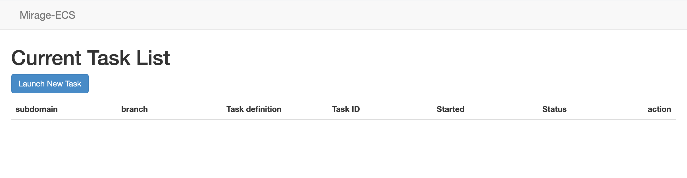
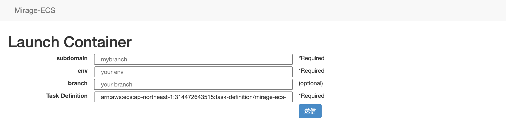
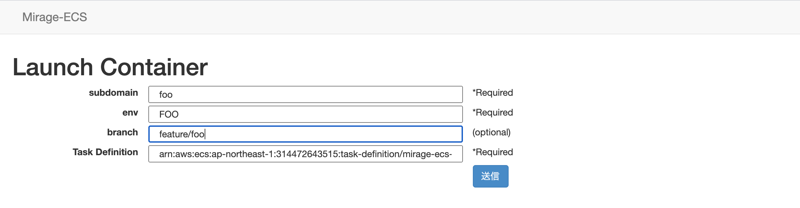
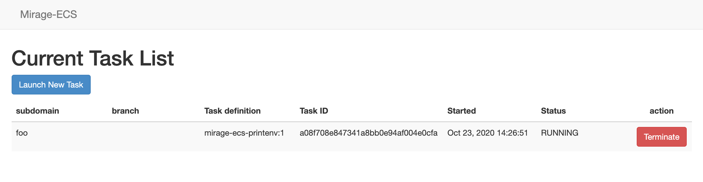
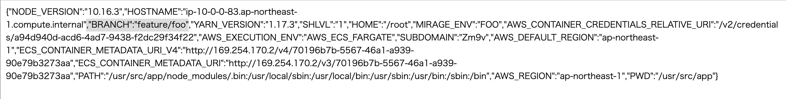

# mirage ecs example

## Setup custom domain application

```console
$ copilot app init mirage-ecs-example --domain test.example.com
✔ Created the infrastructure to manage services under application mirage-ecs-example.

✔ The directory copilot will hold service manifests for application mirage-ecs-example.

Recommended follow-up actions:
- Run `copilot init` to add a new service to your application.
```

```console
$ copilot init
Welcome to the Copilot CLI! We're going to walk you through some questions
to help you get set up with an application on ECS. An application is a collection of
containerized services that operate together.

Your workspace is registered to application mirage-ecs-example.
Service type: Load Balanced Web Service
Service name: mirage
Dockerfile: ./Dockerfile
no EXPOSE statements in Dockerfile ./Dockerfile
Port: 80
Ok great, we'll set up a Load Balanced Web Service named mirage in application mirage-ecs-example listening on port 80.

✔ Created the infrastructure to manage services under application mirage-ecs-example.

✔ Wrote the manifest for service mirage at copilot/mirage/manifest.yml
Your manifest contains configurations like your container size and port (:80).

✔ Created ECR repositories for service mirage.

All right, you're all set for local development.
Deploy: No

No problem, you can deploy your service later:
- Run `copilot env init --name test --profile default --app mirage-ecs-example` to create your staging environment.
- Update your manifest copilot/mirage/manifest.yml to change the defaults.
- Run `copilot svc deploy --name mirage --env test` to deploy your service to a test environment.
```

## Create test environment

```console
$ copilot env init --name test --app mirage-ecs-example
Would you like to use the default configuration for a new environment?
    - A new VPC with 2 AZs, 2 public subnets and 2 private subnets
    - A new ECS Cluster
    - New IAM Roles to manage services in your environment
 Yes, use default.
✔ Created the infrastructure for the test environment.
- Virtual private cloud on 2 availability zones to hold your services     [Complete]
- Virtual private cloud on 2 availability zones to hold your services     [Complete]
  - Internet gateway to connect the network to the internet               [Complete]
  - Public subnets for internet facing services                           [Complete]
  - Private subnets for services that can't be reached from the internet  [Complete]
  - Routing tables for services to talk with each other                   [Complete]
- ECS Cluster to hold your services                                       [Complete]
- Application load balancer to distribute traffic                         [Complete]
✔ Linked account 123456789012 and region ap-northeast-1 to application mirage-ecs-example.

✔ Created environment test in region ap-northeast-1 under application mirage-ecs-example.
```

## Configure environment variable for copilot

copilot/mirage/manifest.yml
```yaml
# ...
# Optional fields for more advanced use-cases.
#
variables: # Pass environment variables as key value pairs.
  CLUSTER: mirage-ecs-example-test-Cluster-aj2rfPwjQkmW
  SUBNET_1: subnet-061ed08ba2cf50625
  SUBNET_2: subnet-0645c2f9025291051
  SECURITY_GROUP: sg-0a657c0cf2e66cbb5
  DEFAULT_TASKDEF: arn:aws:ecs:ap-northeast-1:123456789012:task-definition/mirage-ecs-printenv:1
  DOMAIN: test.mirage-ecs-example.test.example.com
```

- CLUSTER: ECS Cluster name
- SUBNET_1, SUBNET_2: VPC Subnet ID (copilot-mirage-ecs-example-test-pub* must be public subnet)
- SECURITY_GROUP: Security Group ID (mirage-ecs-example-test-EnvironmentSecurityGroup-*)
- DEFAULT_TASKDEF: Task definition ARN to be launched by mirage-ecs. e.g. [taskdef.json](taskdef.json)
- DOMAIN: custom domain name

## XXX: Customize IAM Role and Route53 by manually...

TODO: by Copilot.

- Attach a policy: `arn:aws:iam::aws:policy/AmazonECS_FullAccess` to TaskRole (e.g. `role/mirage-ecs-example-test-mirage-TaskRole-xxxxx`).
- Remove a statement `Deny iam:*` in DenyIAMExceptTaggedRoles inline policy in TaskRole.
- Add Route53 record set `*.test.mirage-ecs-example.test.example.com`  Alias to ALB (created by Copilot)

## Deploy mirage-ecs service to test env

```console
$ copilot svc deploy --name mirage --env test

(snip)

✔ Deployed mirage, you can access it at https://mirage.test.mirage-ecs-example.test.example.com
```

## Access to mirage-ecs!

https://mirage.test.mirage-ecs-example.test.example.com










https://foo.test.mirage-ecs-example.test.example.com


